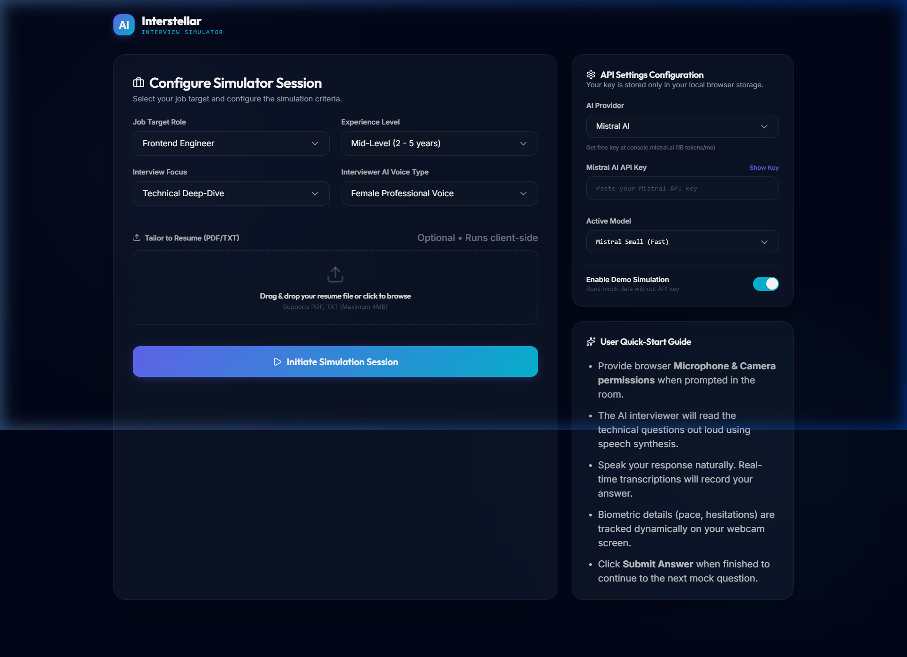
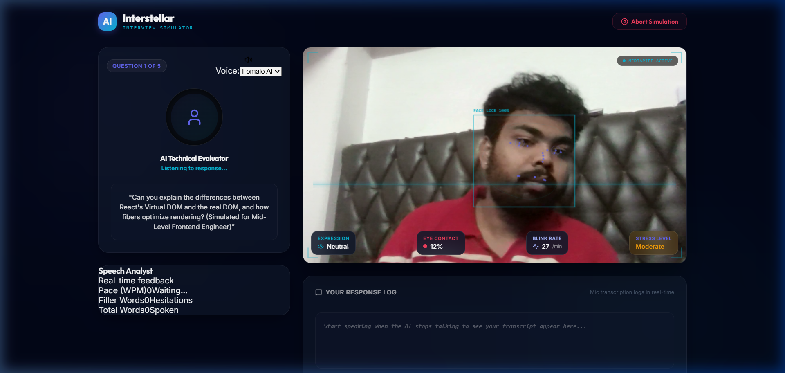

<p align="center">
  
  
  
  
  
</p>

<h1 align="center">🚀 Interstellar — AI Interview Simulator</h1>

<p align="center">
  <strong>A fully client-side AI-powered mock interview platform with real-time facial analysis, speech recognition, and multi-provider LLM support.</strong>
</p>

<p align="center">
  Practice technical, system design, and behavioral interviews with an AI interviewer that listens, watches, and gives you detailed performance analytics.
</p>

---

## 📸 Screenshots

<details open>
<summary><strong>Setup Screen — Configure Your Session</strong></summary>

<br/>



> Select your target role, experience level, interview focus, upload a resume, and choose your AI provider — all from a sleek glassmorphic dashboard.

</details>

<details open>
<summary><strong>Interview Room — Live AI Session with Face Tracking</strong></summary>

<br/>



> Real-time MediaPipe face landmark detection with biometric HUD overlay. The AI asks questions via text-to-speech, and your responses are captured through the browser's speech recognition API.

</details>

---

## ✨ Features

### 🎯 AI-Powered Interviews
- **5 tailored questions** generated per session based on role, difficulty, and interview type
- **Resume-aware** — upload a PDF/TXT resume and get questions specific to your experience
- **Three interview modes**: Technical Deep-Dive, System Design, and Behavioral (STAR)
- **8 preset roles** + custom write-in support

### 🤖 Multi-Provider AI Support
Switch between three AI providers without changing any code:

| Provider | Free Tier | Models Available |
|----------|-----------|-----------------|
| **Google Gemini** | Limited daily quota | Gemini 2.5 Flash, 3.5 Flash, 2.5 Pro, 3.1 Pro |
| **OpenRouter** | 200 req/day (no credit card) | DeepSeek V4, Llama 3.3 70B, Qwen3 Coder, Gemma 4 |
| **Mistral AI** | 1B tokens/month | Mistral Small, Mistral Large, Codestral |

### 📷 Real-Time Face Analysis (MediaPipe)
- **478 facial landmarks** tracked at 15fps via MediaPipe FaceLandmarker
- **Expression detection** — Speaking, Confident, Focused, Surprised, Neutral
- **Eye contact tracking** — gaze deviation analysis from 4 directional blendshapes
- **Blink rate monitoring** — blinks per minute from eye closure blendshapes
- **Stress level estimation** — composite score from blink rate + brow tension + gaze breaks
- **Graceful fallback** — simulation mode if camera/ML model is unavailable

### 🎤 Speech Analytics
- **Real-time transcription** via Web Speech Recognition API
- **Words-per-minute (WPM)** tracking with optimal range highlighting (110–150 WPM)
- **Filler word detection** — catches "um", "uh", "like", "so", "you know", "actually", "basically"
- **Confidence scoring** — 100% baseline, -5% per filler word (floor at 50%)

### 🔊 AI Voice Synthesis
- **Text-to-speech** interviewer reads questions aloud using the browser's SpeechSynthesis API
- **Gender selection** — choose between male and female professional voices
- **Smart mic coordination** — microphone auto-mutes while the AI is speaking

### 📊 Detailed Analytics Report
- **Overall performance score** (0–100) displayed as a doughnut gauge
- **5-axis skill radar** — Technical Depth, Communication, Structure, Confidence, Pacing
- **Speaking pace timeline** — WPM trend line across all questions
- **Per-question breakdown** — expandable accordion with strengths, weaknesses, and improvement advice
- **Export to PDF** via browser print dialog

### 🎨 Premium UI/UX
- **Glassmorphism design system** with custom CSS variables
- **Dark mode** with ambient gradient background glows
- **Smooth animations** — fade-in, slide-up, pulse, and avatar ring effects
- **Responsive layout** — grid breakpoints at 992px and 600px
- **Google Fonts** — Inter + Outfit for premium typography

---

## 🏗️ Architecture

```
┌─────────────────────────────────────────────────────────────┐
│                    🌐 Browser Runtime                       │
│                                                             │
│  ┌──────────┐  ┌──────────────┐  ┌───────────────────────┐  │
│  │ Setup    │  │ Interview    │  │ Report View           │  │
│  │ View     │→ │ Room View    │→ │ (Chart.js Dashboard)  │  │
│  └──────────┘  └──────┬───────┘  └───────────────────────┘  │
│                       │                                      │
│       ┌───────────────┼───────────────┐                      │
│       ▼               ▼               ▼                      │
│  ┌─────────┐   ┌───────────┐   ┌──────────┐                │
│  │ Speech  │   │ Webcam    │   │ Voice    │                 │
│  │ Tracker │   │ Scanner   │   │ Synth    │                 │
│  │ (STT)   │   │(MediaPipe)│   │ (TTS)    │                 │
│  └────┬────┘   └─────┬─────┘   └────┬─────┘                │
│       ▼              ▼               ▼                       │
│  ┌─────────────────────────────────────────┐                │
│  │         Browser Native APIs             │                │
│  │  SpeechRecognition │ getUserMedia       │                │
│  │  SpeechSynthesis   │ Canvas 2D          │                │
│  └─────────────────────────────────────────┘                │
│                       │                                      │
└───────────────────────┼──────────────────────────────────────┘
                        │ REST API
          ┌─────────────┼─────────────┐
          ▼             ▼             ▼
    ┌──────────┐  ┌──────────┐  ┌──────────┐
    │  Google  │  │  Open    │  │ Mistral  │
    │  Gemini  │  │  Router  │  │    AI    │
    └──────────┘  └──────────┘  └──────────┘
```

> **100% client-side** — no backend server required. API keys are stored exclusively in `localStorage`.

---

## 📁 Project Structure

```
interviewsim/
├── index.html                  # Entry HTML with PDF.js CDN + Google Fonts
├── package.json                # React 19, Vite 8, Chart.js, MediaPipe
├── vite.config.js              # Vite + React plugin config
├── docs/                       # Screenshots for README
├── public/
│   ├── favicon.svg             # App favicon
│   └── icons.svg               # SVG icon sprite
└── src/
    ├── main.jsx                # React root mount (StrictMode)
    ├── App.jsx                 # Main orchestrator — 3 views, ~25 state hooks
    ├── App.css                 # Complete glassmorphism design system (1183 lines)
    ├── index.css               # Base CSS reset
    ├── components/
    │   ├── SpeechTracker.jsx   # 🎤 Real-time STT + WPM + filler detection
    │   ├── VoiceSynthesizer.jsx# 🔊 TTS engine with gender selection (forwardRef)
    │   ├── WebcamScanner.jsx   # 📷 MediaPipe face detection + Canvas HUD
    │   └── FeedbackReport.jsx  # 📊 Chart.js analytics dashboard
    └── services/
        └── gemini.js           # 🤖 Multi-provider LLM router + mock data
```

---

## 🚀 Getting Started

### Prerequisites

- **Node.js** 18+ and **npm**
- A modern browser (Chrome or Edge recommended for Speech Recognition API)
- An API key from at least one provider (or use Demo Mode)

### Installation

```bash
# Clone the repository
git clone https://github.com/Navneet0710/AI_Interview_Simulator.git
cd AI_Interview_Simulator

# Install dependencies
npm install

# Start the development server
npm run dev
```

The app will be available at `http://localhost:5173/`.

### API Key Setup

1. Open the app and look at the **API Settings Configuration** panel on the right
2. Select your preferred **AI Provider** from the dropdown
3. Paste your API key (get one free from the links below)
4. Select a model and click **Initiate Simulation Session**

| Provider | Get Free Key |
|----------|-------------|
| Google Gemini | [ai.google.dev](https://ai.google.dev) |
| OpenRouter | [openrouter.ai](https://openrouter.ai) — no credit card needed |
| Mistral AI | [console.mistral.ai](https://console.mistral.ai) — 1B tokens/month free |

> **💡 Tip:** Enable **Demo Mode** to test the full interview flow without any API key — it uses locally generated mock questions and evaluations.

---

## 🛠️ Scripts

| Command | Description |
|---------|-------------|
| `npm run dev` | Start Vite dev server with HMR |
| `npm run build` | Build for production → `./dist/` |
| `npm run preview` | Preview the production build locally |
| `npm run lint` | Run Oxlint for code quality checks |

---

## 🧰 Tech Stack

| Layer | Technology | Purpose |
|-------|-----------|---------|
| **Framework** | React 19 + Vite 8 | UI rendering, HMR, bundling |
| **Styling** | Vanilla CSS (Glassmorphism) | Custom dark-mode design system |
| **Typography** | Google Fonts (Inter + Outfit) | Premium typefaces |
| **Icons** | Lucide React | SVG icon library |
| **Charts** | Chart.js + react-chartjs-2 | Radar, Doughnut, Line charts |
| **Face AI** | MediaPipe FaceLandmarker | Real-time facial analysis |
| **Speech Input** | Web Speech Recognition API | Voice-to-text transcription |
| **Speech Output** | Web SpeechSynthesis API | AI reads questions aloud |
| **Camera** | MediaDevices.getUserMedia | Live webcam feed |
| **PDF Parsing** | PDF.js (CDN) | Client-side resume extraction |
| **AI Backend** | Gemini / OpenRouter / Mistral | Question generation + evaluation |

---

## 🔒 Privacy & Security

- **No backend server** — everything runs in the browser
- **No data leaves your device** except API calls to the LLM provider you choose
- **API keys** stored in `localStorage` (never sent to any third party)
- **Camera/Mic** access is permission-gated with a clear authorization modal
- **Resume parsing** happens entirely client-side via PDF.js — no file uploads
- **No cookies, no tracking, no analytics**

---

## 🤝 Contributing

Contributions are welcome! Here are some areas that could use help:

- [ ] Split `App.jsx` monolith into separate view components
- [ ] Add React Router for URL-based navigation
- [ ] Implement follow-up questions (multi-turn conversation)
- [ ] Add a code editor mode (Monaco) for live coding interviews
- [ ] Historical session tracking with IndexedDB
- [ ] Dark/Light theme toggle
- [ ] Unit and integration tests

### Steps

1. Fork the repository
2. Create a feature branch (`git checkout -b feature/amazing-feature`)
3. Commit your changes (`git commit -m 'Add amazing feature'`)
4. Push to the branch (`git push origin feature/amazing-feature`)
5. Open a Pull Request

---

## 📄 License

This project is licensed under the MIT License — see the [LICENSE](LICENSE) file for details.

---

<p align="center">
  Built with ❤️ using React, MediaPipe, and the power of AI
</p>
